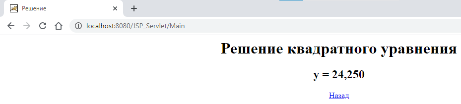

# GVS03_JSP_Servlet

## Разработка многоуровневых приложений

### Задание №3, 3 вариант

#### Доступ к серврлету через интернет (вне локальной сети):

1. Зайти в папку куда установлен `Apache Tomcat`, открыть файл `conf/server.xml`, найти `Connector`
   - Изменить `port` на отличный от стандартного `8080`, например `8081`
   - Добавить свойство `address="0.0.0.0"`
   - В итоге должно получиться:
     ```
     <Connector port="8081" protocol="HTTP/1.1"
                address="0.0.0.0"
                connectionTimeout="20000"
                redirectPort="8443"/>
      ```
2. Открыть указанный порт в файрволле и в настройках роутера
3. Для подключение использовать `IP:PORT/My_Servlet`, где:
   - `IP` - внешний адрес
   - `PORT` - указанный порт в конфигурации ранее
   - `/My_Servlet` - путь к сервлету.



